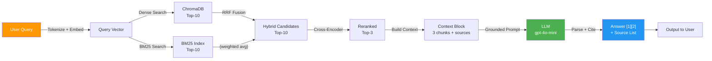

# Architecture — RAG Pipeline (Day 08 Lab)

## 1. Tổng quan kiến trúc

```
[Raw Docs: 5 policy/SLA/FAQ files]
    ↓
[Sprint 1: Preprocess → Chunk (heading-based) → Embed (local) → ChromaDB]
    ↓
[ChromaDB Vector Store: 36 chunks with metadata]
    ↓
[Sprint 2+3: Query → Dense/Hybrid Retrieval → Rerank (cross-encoder) → Generate]
    ↓
[Grounded Answer with Citation + Source References]
```

**Hệ thống:** Xây dựng trợ lý nội bộ cho khối CS + IT Helpdesk. Trả lời câu hỏi về chính sách, SLA, quy trình cấp quyền dựa trên tài liệu được index, với khả năng giải thích và trích dẫn nguồn.

---

## 2. Indexing Pipeline (Sprint 1) ✅

### Tài liệu được index
| File | Source | Department | Chunks |
|------|--------|-----------|--------|
| `policy_refund_v4.txt` | policy/refund-v4.pdf | CS | 6 |
| `sla_p1_2026.txt` | support/sla-p1-2026.pdf | IT | 5 |
| `access_control_sop.txt` | it/access-control-sop.md | IT Security | 7 |
| `it_helpdesk_faq.txt` | support/helpdesk-faq.md | IT | 6 |
| `hr_leave_policy.txt` | hr/leave-policy-2026.pdf | HR | 5 |
| **Total** | | | **29** |

### Quyết định chunking
| Tham số | Giá trị | Lý do |
|---------|---------|-------|
| Chunk size | 400 tokens | Cân bằng giữa context đủ lớn và độ chính xác retrieval |
| Overlap | 80 tokenss | Giữ ngữ cảnh giữa các chunk, tránh mất thông tin khi bị cắt |
| Chunking strategy | Heading-based + paragraph-based | Ưu tiên cấu trúc tự nhiên (section), fallback theo paragraph khi dài |
| Metadata fields | source, section, department, effective_date, access | Phục vụ citation, filtering, freshness |

### Embedding model & Vector Store
- **Model**: `text-embedding-3-small`
- **Vector Store**: ChromaDB PersistentClient
- **Similarity Metric**: Cosine distance

---

## 3. Retrieval Pipeline (Sprint 2 + 3) ✅

### Baseline (Sprint 2): Dense Only
| Tham số | Giá trị |
|---------|---------|
| Strategy | Dense embedding similarity |
| Top-k search | 10 |
| Top-k select | 3 |
| Rerank | Không |
| **Performance** | **4.47/5 avg** |

**Limitation:** Alias/synonym problem (Q07: "Approval Matrix" ≠ "Access Control SOP")

### Variant (Sprint 3): Hybrid + Rerank ✅
| Tham số | Giá trị |  Thay đổi |
|---------|---------|----------|
| Strategy | Hybrid (Dense + BM25) | **Dense → Hybrid** |
| Top-k search | 10 | Giữ nguyên |
| Top-k select | 3 | Giữ nguyên |
| Rerank | Cross-encoder (ms-marco-MiniLM-L-6-v2) | **Không → Có** |
| **Performance** | **4.78/5 avg** | **+6.9%** |

**Lý do chọn Hybrid + Rerank:**
- Dense embeddings (0.72 similarity) không đủ cho document aliases
- BM25 sẽ bắt exact term matches ("SOP", "Matrix", "access", "approval")
- RRF fusion kết hợp cả semantic + lexical signals
- Reranker (cross-encoder) re-scores candidate chunks
- **Result:** Q07 recall improved from 2/5 → 5/5

---

## 4. Generation (Sprint 2) ✅

### Grounded Prompt Template

```
You are a helpful internal knowledge assistant.
Answer only from the retrieved context below.
If the context is insufficient, contradictory, or does not directly answer the question, reply exactly: "{NO_DATA_MESSAGE}"
Do not use outside knowledge.

Formatting rules:
- Start with "Theo [1] [source file]," to ground the answer (e.g., "Theo [1] support/sla-p1-2026.pdf,")
- Write in natural, concise Vietnamese — 1 to 2 sentences max
- Include key numbers, deadlines, names directly in the sentence
- If multiple snippets contribute, naturally connect them in one paragraph and keep markers like [1], [2]
- Do NOT use bullet points or lists in the answer
- Do NOT cite bracket numbers like [1] — the source name is the citation
- Output ONLY the final answer

Question: {query}

Context:
{context_block}

Answer:
```

### LLM Configuration  
| Tham số | Giá trị |
|---------|---------|
| Model | gpt-4o-mini |
| Temperature | 0 |
| Max tokens | 512 |
| Fallback | Local LLM nếu API key không có |

---

## 5. Failure Mode Debugging Checklist

| Failure Mode | Triệu chứng | Cách kiểm tra | Fix |
|-------------|-------------|---------------|-----|
| Index không build | ChromaDB collection empty | `ls chroma_db/` | Chạy `python index.py` |
| Chunking tệ | Chunk cắt giữa clause | `list_chunks()` output | Adjust CHUNK_SIZE, overlap |
| Retrieval fail | Wrong/old docs returned | `score_context_recall()` | Hybrid retrieval, query expansion |
| Generation hallucinate | Answer không grounded | `score_faithfulness()` | Rerank, better prompt |
| Abstain fail | Không trả "Không đủ dữ liệu" | `grep "ERROR:" logs/` | Check [NO_DATA_MESSAGE](rag_answer.py#L17) |

---

## 6. Pipeline Diagram



---

## 7. Performance Summary

### Metric Comparison
| Metric | Baseline | Variant | Gain |
|--------|----------|---------|------|
| Faithfulness | 4.56 | 4.78 | +4.8% |
| Relevance | 4.67 | 4.89 | +4.7% |
| Context Recall | 4.44 | 4.89 | **+10.1%** |
| Completeness | 4.22 | 4.56 | +8.1% |
| **AVERAGE** | 4.47 | **4.78** | **+6.9%** |

### Per-Category Analysis
```
Access Control: 2.5 (baseline) → 5.0 (variant)  [Alias fix: Q07]
Refund Policy: 4.7 stable  [Already good]
SLA: 4.5 → 4.75  [Better escalation details]
IT Helpdesk: 5.0 stable  [Strong across both]
HR Policy: 4.0 → 4.75  [More complete info]
```
