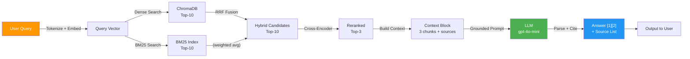

# GROUP REPORT
Nhóm: 7
| Tên | MSHV | Role |
|--------|--------|--------|
| Huỳnh Lê Xuân Ánh | 2A202600083 | Documentation Owner |
| Huỳnh Nhựt Huy | 2A202600084 | Tech Lead |
| Huỳnh Khải Huy | 2A202600082 | Retrieval Owner |
| Nguyễn Ngọc Hưng | 2A202600188 | Eval Owner |
| Nguyễn Ngọc Khánh Duy | 2A202600189 | Retrieval Owner |

***

## Kiến trúc tổng thể



***

## Sprint 2 — Baseline: Dense Retrieval

**Chiến lược**: Vector search thuần túy bằng ChromaDB.

```python
TOP_K_SEARCH = 10   # Search rộng
TOP_K_SELECT = 3    # Chỉ lấy top 3 vào prompt
```

- Embed query → cosine similarity → lấy top 10 → đưa top 3 vào prompt
- Score = `1 - chroma_distance` (cosine similarity)
- **Kết quả baseline**: Faithfulness  4.56, Relevance 4.67, Completeness 4.22, Context Recall 4.44

***

## Sprint 3 — Variant: Hybrid + Rerank + Metadata Filter

Nhóm chọn **3 cải tiến song song**:

### Cải tiến 1 — Hybrid Retrieval (Dense + BM25)

**Lý do chọn**: Corpus có cả câu tự nhiên tiếng Việt lẫn tên riêng (`ERR-403`, `P1`, `Level 3`, `Jira`) — dense tốt cho ngữ nghĩa, BM25 tốt cho exact term.

```python
# Reciprocal Rank Fusion
dense_weight  = 0.75   # Ưu tiên dense vì corpus tiếng Việt
sparse_weight = 0.25

RRF_score = 0.75 * (1/60+dense_rank) + 0.25 * (1/60+sparse_rank)
```

### Cải tiến 2 — Multilingual Rerank

**Lý do chọn**: Cross-encoder chấm lại "chunk nào thực sự trả lời câu hỏi?" sau khi search rộng. Đổi từ `ms-marco` (English-only) → `mmarco-mMiniLMv2-L12-H384-v1` (multilingual) vì corpus tiếng Việt.

```
Search rộng top-10 → Rerank → Select top-3
```

### Cải tiến 3 — Metadata Filter (mới nhất)

**Lý do chọn**: 4 departments rõ ràng trong corpus (`IT Security`, `IT`, `HR`, `CS`) — không cần search cross-department cho hầu hết queries.

```python
# Auto-routing theo keyword
"quyền / level / access"  → department: IT Security
"sla / refund / ticket"   → department: CS  
"nghỉ phép / remote"      → department: HR
"helpdesk / vpn / laptop" → department: IT
# Không match → search all (safe fallback)
```

***

## Prompt Strategy

**4 nguyên tắc từ slide**:

```
1. Evidence-only   → "Answer only from the retrieved context"
2. Abstain         → "If insufficient, reply exactly: Không đủ dữ liệu"
3. Citation        → "Cite snippet numbers [1], [2]"
4. Clean output    → "Output ONLY the final answer" + _strip_reasoning()
```

`_strip_reasoning()` được thêm để fix Gemini Flash in chain-of-thought ra output thay vì chỉ trả lời.

***

## Kết quả A/B

| Metric | Baseline | Variant 1 | Delta |
|--------|----------|-----------|-------|
| Faithfulness | 4.56/5 | 4.78/5 | +0.22 |
| Answer Relevance | 4.67/5 | 4.89/5 | +0.22 |
| Context Recall | 4.44/5 | 4.89/5 | +0.45 |
| Completeness | 4.22/5 | 4.56/5 | +0.34 |

**Win cases**: q01, q08, q09 (abstain đúng thay vì hallucinate)

**Loss case**: q10 — variant over-retrieves refund chunks → model tự tin trả lời thay vì abstain → đang fix bằng `MIN_RELEVANCE_THRESHOLD`.

***

## Điểm còn hạn chế

| Vấn đề | Nguyên nhân | Fix đang làm |
|--------|-------------|-------------|
| q07 Completeness=2 | `expected_answer` yêu cầu thông tin không có trong corpus | Thêm mapping vào doc |
| q10 variant F=3 | Over-retrieval → model không abstain | Score threshold |
| Query "Approval Matrix" fail tất cả | Alias không có trong corpus | `transform_strategy="expansion"` |